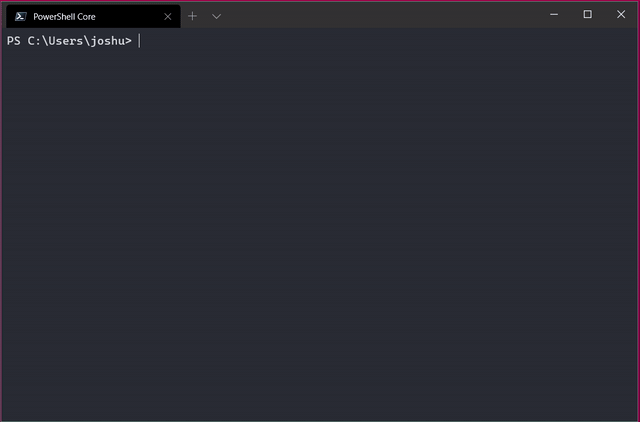

randmac.py
==========

randmac is a utility that generates 12-digit mac addresses; either the NIC portion or full 12-digit MAC. 

The optional `-f` argument will return a random 12-digit MAC address that can be identified by the locally administrated address (LAA) format. This means you will always see `x2`, `x6`, `xA`, or `xE` at the beginning of a MAC address generated by randmac.



# Installation

To install with pip:

`python3 -m pip install randmac`

# Requirements

Python 3.2 or greater is required.

# Supported MAC address formats

Supported formats:

 - MM:MM:MM:SS:SS:SS (colons)
 - MM-MM-MM-SS-SS-SS (hyphens/dashes)
 - MM.MM.MM.SS.SS.SS (dots/periods)
 - MMMM.MMSS.SSSS (cisco style)
 - MMMMMMSSSSSS (no separator)

where `M` stands for the manufacturer or vendor, and `S` stands for the NIC specific portion. 

# Usage

```
usage: randmac [-h] [-V] [-p] [mac]

Generates MAC addresses. By default randmac will generate a 12-digit MAC address following the Locally Administrated Address (LAA) format. randmac only supports 12-digit (48-bit) MAC addresses.

positional arguments:
  mac            mac address required for output format

options:
  -h, --help     show this help message and exit
  -V, --version  show program's version number and exit
  -p, --partial  randomizes the NIC portion of a MAC address
```

In your own code, you can `from randmac import RandMac` and use it like `RandMac()`. If you wish to change the mac address format, pass in a sample MAC address with the target format. This means you can `from randmac import RandMac` and use it like `RandMac("0000.0000.0000")` or `RandMac("ff-ff-ff-dd-dd-dd")` to specify the delimiter format.

From a terminal (if the the console scripts entry point `randmac` is in your path and executable) you can type `randmac` and press enter to get a generate a new 12-digit LAA address, or `randmac 00:00:00:00:00:00 -p` to generate a MAC with the same OUI, but a different NIC portion. The result will look something like `00:00:00:60:cf:6e`.

# Example usage

From Python:

```
>>> from randmac import RandMac
>>> RandMac()
'a6:9b:6b:8e:b3:42'
>>> RandMac("00:00:00:00:00:00", True)
'00:00:00:3f:8a:06'
>>> RandMac("0000:0000:0000", True)
'0000007ce662'
>>> RandMac("0000:0000:0000")
'06eb4584d1e3'
```

From CLI:

```
> randmac
fa:bf:7c:5d:65:3e
> randmac 00-00-00-00-00-00 -p
00-00-00-dd-5f-16
``` 

# License

The license for this project can be found [here](https://github.com/joshschmelzle/randmac/blob/master/LICENSE).
